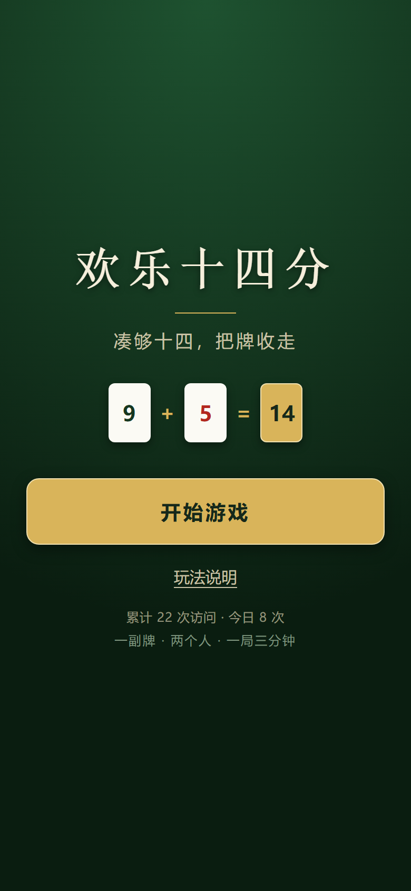
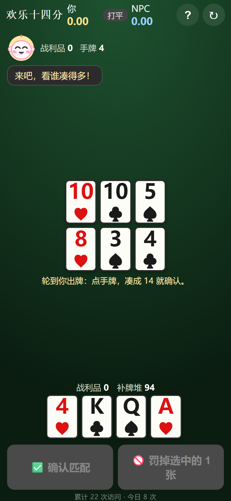

# 欢乐十四分 🤡

卡通风格的「凑 14」单机小游戏。**三套前端共用同一份游戏内核**：

- **手机版 H5**（在线链接，点开即玩）
- **Windows 安装版**（Electron，可打包成 `.exe`）
- **微信小程序版**





---

## 一、规则要点（已实现）

1. **牌**：2 副标准牌（含大小王）= 108 张。点数 A=1、2~10=面、J=11、Q=12、K=13。
   - **大王计分 1 分、小王 0.75 分**；**配 14 时大小王算 0（随便配，可顺手捞走）**。
2. **花色计分**：黑桃 1 分、红桃 0.75 分、草花 0.5 分、方片 0.25 分（王按自身分值计）。
3. **开局**：桌面上下两行摊开 6 张；玩家与 NPC 各抓 4 张；其余为补牌堆。
4. **出牌（轮流出，先手随机——双方各 50%，不是永远玩家先手）**：看手牌（单张或几张）能否与桌面**某一张**相加 = 14。
   - 能：把这些牌全当战利品收走 → 从手牌挑 1 张补回桌面（手牌空则从补牌堆拿 1 张）→ 从补牌堆把手牌补到 4 张。
   - 不能：挑 1 张手牌作**罚牌**（隐藏，不向大家显示），手牌 −1，随后仍从补牌堆把手牌补满到 4 张（补牌堆不够则尽力补）。
5. **残局**：补牌堆抓完（即不足）后继续用手牌匹配，手牌只减不增（不再补满 4 张），直到双方都无法匹配且手牌耗尽，一局结束。
6. **计分**：得分 = 战利品合计 − 罚牌合计，高者胜。
7. **NPC 难度（四档，开局会问一句）**：点「新游戏」先弹「这局打什么难度?」，选好点「开始」才开局；可勾「以后开局别再问我」（随时可在侧栏改）。侧栏四档：
   - **容易**：大半随缘出牌，还常把高分牌罚掉 → 送分局。
   - **中等**：一步贪心——选当前得分最高的匹配（优先顺手捞王）。
   - **难**：出牌同中等，但**补到桌面那一张**算了笔两头的账——既不喂你（用未见牌池抽样估你会捞走多少），也**给自己留后路**（估自己下一手能捞多少，按 1:2 权重合并），不再随手喂你。
   - **地狱**：每种打法都**推演到终局**再挑最优的一手（本地计算，无模型依赖），几乎算死你。

   NPC **罚牌也有一套账**（不是只赔眼前最便宜的）：总代价 = 牌价 − 0.06×点数。大点数的牌凑 14 伙伴少（K 只能配 3），留着不如小牌值钱——所以你常会看到它宁愿多赔 0.5 分也把红桃 K 罚掉、留下方片 4。王百搭，永远不拿去罚。
   > 实测强度（`difficulty-lab.js`，玩家基线=贪心，配对发牌、先后手交替，各 400 局）：NPC 胜率 **容易 39% / 中等 52% / 难 80% / 地狱 92%**。切换即时生效，选择会被记住。

   **手机版 · 🧠 学习系统**（2026-09-23 上线，替代原「自适应」档）：顶部 🧠 按钮打开面板。
   - **只学你赢的局**：打赢「难」或「地狱」才复盘；输了只记战绩，不动参数。
   - **引擎当裁判**：拿你**实际出的那一手**去和引擎自己算出的首选比，同一局面、同一补牌，谁推演到终局更赚；再按「补哪张给对手」和「罚哪张」分别统计你的好手。
   - **怎么体现**：每局最多微调一步两个参数（补牌时的"甩负担"权重、罚牌时的"死牌"权重），**容易/中等永远不学**（保持固定手感），**难吃一半、地狱吃全量**。
   - **数据只在本机**（`localStorage`，不联网、不上报）。面板可查看 / 导出 / 重置。
   - **回流**：想让全局 NPC 都变强 → 面板「导出权重」拿到 JSON 发给我，我把它写进 `game-core.js` 的出厂权重再重新发布。
8. 开局及每次补牌顺序随机。
9. **开局宣告先手**：每次新开局，屏幕中央弹出金色大字「你先手 / NPC 先手」，1.6 秒自动淡出——谁先出，一眼看清，不再"哗一下就开始"。

---

## 二、目录结构

```
happy14/
├── game-core.js              # 共享内核（牌堆/规则/算分/贪心），三端共用
├── advisor.js                # 共享顾问（最优判断/胜率蒙特卡洛/NPC 台词）
├── sfx.js                    # 共享音效（振荡器合成，无需音频素材）
├── play.html                 # 零安装浏览器试玩版（双击即玩，复用 electron/src 的 UI）
├── sim-test.js               # 规则校验：双方贪心跑 2000 局，验无异常+牌数守恒
├── ui-test.js                # Web/Electron 界面冒烟测试：DOM 桩真实跑 app.js，端到端跑完整局
├── mini-test.js              # 小程序界面冒烟测试：Page/wx 桩真实跑 game.js，端到端跑完整局
├── mobile-test.js            # 手机版真跑测试：Playwright 无头加载构建产物，四档/学习系统/整局真打
├── style-check.js            # 共享样式检查：核对两版色板一一对应、无死变量、关键区块齐
├── sync-core.js              # 三端内核副本同步 + MD5 校验（`--write` 同步，不加只校验）
├── difficulty-lab.js         # 难度校准台：正确轮流的沙盒，配对发牌比对各档强度
├── tools-bubble.js           # 【真实浏览器】气泡遮挡验证（大娃娃/小气泡 vs 玩家手牌）
├── tools-standalone.js       # 打两个单文件分享版：内联样式+内核 → 桌面单机版 / 手机版 HTML
├── tools-assets.js           # 一次性生成 favicon / 主屏图标 / 分享卡（Playwright）
├── tools-head.js             # 把图标+theme-color+og 注入两个源 HTML（可重跑）
├── tools-verify.js           # 【真实浏览器】遮牌/重叠验证
├── tools-verify-ui.js        # 【真实浏览器】无头真跑单文件，走完 标题页→开局→对局，逐态截图
├── mobile/                   # 手机版（H5）独立前端：index.html / mobile.css / mobile.js
├── site-mobile/              # 手机版在线链接部署目录（构建产物，不入库）
├── docs/shots/               # README 截图
├── HANDOFF.md                # 交接说明（面向 AI 续接，含踩坑记录）
├── 商店与分享文案.md          # 商店/分享文案备稿
├── electron/                 # Windows 安装版
│   ├── package.json          # 含 electron-builder 的 nsis 打包配置
│   ├── main.js               # Electron 主进程
│   └── src/
│       ├── index.html
│       ├── style.css         # 卡通风样式
│       ├── app.js            # 界面与回合控制
│       ├── game-core.js      # 内核副本
│       ├── advisor.js        # 顾问副本
│       └── sfx.js            # 音效副本
└── miniprogram/              # 微信小程序版
    ├── app.js / app.json / app.wxss
    ├── project.config.json
    ├── utils/                # 内核 / 顾问 / 音效 三份副本
    └── pages/game/           # 游戏页（js/wxml/wxss/json）
```

> 内核/顾问/音效是**同一份逻辑**的三个副本（根目录、electron/src、miniprogram/utils）。改逻辑时先改根目录，再跑 `node sync-core.js --write` 同步（它会打印三处 MD5，必须完全一致）。
> ⚠️ `advisor.js` 整个模块包在 IIFE 里：浏览器里多个 `<script>` 共享同一个全局词法环境，若在顶层写 `const G`，会和 `app.js` 顶层的 `const G` 撞成 `Identifier 'G' has already been declared` 直接白屏。

---

## 三、怎么试玩

> **最快的一条**：点开在线链接即玩，手机/电脑都行，不用下载、不用装任何东西 → <https://h14-mobile-98661.app.workbuddy.host/>

### 0. 浏览器试玩版（零安装，最省事）
直接**双击 `happy14/play.html`** 用任意浏览器（Chrome / Edge 等）打开即玩，无需 Node、无需 Electron、无需微信开发者工具。
原理：`play.html` 复用 `electron/src/` 的卡通样式与界面逻辑，只是把内核换成在浏览器里直接加载。
> 若双击打开后是空白或卡住，多半是浏览器禁了本地脚本：把 `happy14/` 目录整体放到一个普通路径（避免中文/空格过深），或改用下面两种方式。

### 1. Windows 安装版（Electron）
```bash
cd electron
npm install          # 首次需联网下载 electron（约 80MB）
npm start            # 启动游戏窗口
npm run dist         # 打包成 Windows 安装包（nsis，输出到 electron/dist/*.exe）
```
> 双击 `dist` 里的 `.exe` 即可安装运行。打包失败多半是没装 NSIS 或网络问题，按 electron-builder 报错处理即可。

### 微信小程序版
1. 打开**微信开发者工具** → 导入项目 → 选择 `happy14/miniprogram` 目录。
2. AppID 先用「测试号」（project.config.json 里已填 `touristappid`），正式发布再换成你自己的。
3. 编译即可在模拟器里玩。

### 操作节奏（两版一致）
- **匹配是三步走的线性动作，每一步都看得见**：
  1. 点手牌 + 点桌面上的一张牌 → 那张桌面牌被**金色虚线框圈住**（和 ≠ 14 时圈框变橙、按钮仍是灰的）；
  2. 点「✅ 确认匹配」→ 圈框**锁定**（变实、牌抬起），接着选中的手牌**朝那张牌飞过去合拢**；
  3. 合拢完成 → 被圈的牌爆一下金光 → 全部收进战利品（战利品计数跳动），转到第 4 步。
  4. 提示你点 1 张手牌补到桌面（这一步由你决定给对手留什么桌面）→ 之后**自动**从补牌堆把手牌补满到 4 张。
- **凑不出 14 怎么办（已简化）**：**界面永远只有选牌这一种状态、永远给两个按钮**——
  「✅ 确认匹配」+「🚫 罚掉选中的 1 张」，**由你自己决定**，系统只在提示语里说一句"检测到凑不出"，绝不替你按。
  罚牌不需要"进入罚牌模式"、也没有"返回"这类来回：**只点 1 张手牌**（按钮会变成「🚫 罚掉 3♠」并亮起）→ 点它 → 那张牌**飞走并隐藏** → 自动补满手牌。
  - 罚牌要求**恰好选中 1 张**：选 0 张或 2 张时按钮是灰的，提示语会告诉你是多了还是少了。
  - 这一步是补的洞：之前玩家自己看不出解（比如 `2♦+10♣` 配桌面 `2♦` 这种不那么直观的组合）时，界面既没有出口、也没有退路。
- 补牌不是"凭空冒出来"：新牌会滑入、补牌堆数字会跳一下、并弹出"补牌 +N"提示。
- **首玩引导**：顶栏新增「❓ 玩法」按钮，随时回看玩法；**首次启动自动弹出**玩法说明，看过一次后用本地存储记住、不再自动弹（想再看随时点按钮）。
- **NPC 每轮匹配都看得见，分五拍演出（指牌 → 抬起 → 逐张翻牌 → 读等式 → 才合牌）**：
  1. **指牌**：棋盘上它看中的那张桌面牌被圈住、挂一个**卡通箭头指着它**，**其余桌面牌同时压暗**（一眼看出它盯的是哪张），停 1.5 秒；
  2. **抬起**：那张牌单独**放大抬起**一下，再停 0.7 秒，明确"我要的就是它"；
  3. **翻牌**：弹出**全屏压暗的模态浮层**「🤖 NPC 把手上的牌翻过来」，把它的手牌（含王）和桌面牌**一张一张依次翻面亮出**（每张隔 0.62 秒，各响一声），牌面放大到 76px；
  4. **读等式**：全部翻完、等式（如 `A♠ + 3♥ + 10♦ = 14 ✅ 收获 3 张 · +2.25 分`）淡入后**停 2 秒**，够你读完；
  5. **合牌**：浮层里的牌**收拢合起**、棋盘那张牌胀一下爆金光 → 才真正入账并自动补牌。
  - 节奏由 `T_NPC_POINT`(1500) / `T_NPC_LIFT`(700) / `T_NPC_FLIP`(620/张) / `T_NPC_READ`(2000) / `T_NPC_MERGE`(900) 控制，觉得快慢不合适直接改这几个数。
  - 每拍都写日志（`👀 看中了桌面…` → `🤖 NPC 亮牌：…` → `🔗 NPC 合牌收走…`），翻回去对得上。
  - NPC 无法匹配时会明确提示"罚牌 1 张（隐藏）"。
- **NPC 是个"歪戴棒球帽的小痞机器人"，重要情境还会"蹦出个大娃娃"说话**：
  - 形象（Web 端内联 SVG、小程序端 WXSS 绘制，都不用图片素材）：**反扣的蓝棒球帽 + 翘帽檐 + 耳机 + 天线小灯泡 + 牙签**，脑袋是奶油色大圆脸。
  - **六种表情，差别做得很明显**（不是同一张脸换个颜色）：`idle` 叼牙签小微笑 · `think` 一高一低的眉 + 瞟一边的眼珠 + 抿成小圈嘴 · `happy` 笑眼 + 张嘴笑 + 腮红 · `greedy`（捞到王）**星星眼 + 大笑 + 流口水** · `shock` 瞪眼 + 下巴掉了 · `sad` 八字眉 + 耷拉眼 + **掉眼泪**。头顶光晕和天线灯泡也跟着变色。
  - 平时碎嘴走座位里的小气泡；**关键情境**（捞到王、大手笔、罚牌吃瘪、被你抢走王、结算嘴炮）会从底部**蹦出一个放大的卡通娃娃 + 对话气泡**说完自己退场——**和你抢着把王捞走时得意**（"嘿嘿，王归我了！"）、大赚（"这波赚到了！"）、认罚（"哎，这手真凑不出…"）、结算（"这局我认了，下把再来。"）。
  - 哪些算"重要台词"由 `advisor.js` 的 `SMALL_EVENTS` 决定（只有 `npcMatch` / `lowDraw` 是碎嘴），其余一律弹大娃娃。
- **每一手都有"是否最优"的判断，而且告诉你为什么**：出牌、补到桌面、罚牌都会和本回合所有合法选择比一遍，立刻给结论 + **依据**——
  - **出牌的判据**：把本回合**所有**合法匹配都枚举出来，按「得分优先 → 同分多捞王 → 同分少用手牌」排序，第一名就是最优。你出的那手和第一名比：
    - 最优：`📈 最优判断：出牌 +2.25 分 ✅ 这是本回合最赚的一手。`
    - 不是最优，且**分值差**：`⚠️ 不是最优 —— 还有一手能多拿 +0.25 分：9♠ + 5♠ = 14`
    - 不是最优，但**分值相同**：会说清差在哪 —— `同样是 2.25 分，但多捞 1 张王（王配 14 算 0，等于白送一张好牌）` 或 `同样是 2.25 分，但少用 1 张手牌（手牌薄了，下回合更难受）`。
    - **所以"亏"只可能是三种原因**：少拿分、同分没捞到王、同分多耗了手牌。不会有别的玄学理由。
  - **补到桌面（补哪张给对手）的判据**：摊到桌面 = 送给对手的牌，代价是"**期望送分 = 这张牌的分值 × 它被对手吃走的概率**"。
    - 概率不是拍脑袋：从**明牌推算出的未知牌池**（108 张扣掉你的手牌/双方战利品与罚牌/桌面 6 张）里，每次抽 4 张当作对手手牌，统计"能不能凑出 `14 − 这张牌` 的非空子集"，跑很多次得频率 P。
    - 所以**分值越低越该扔，同时"容易被吃"的牌更该扔**。实测概率：`K` 只剩 26.8% 会被吃走，`A` 高达 62.3%，`2`/`王` 这类低值牌分值本身就低——`2♠` 的期望送分远小于 `K♦`。
    - 提示文案会说清依据，例如：`💡 这张补到桌面偏亏：它值 0.75 分、估计 48% 会被吃走，期望送 0.36 分；换 2♦（值 0.25 分）更稳`。
  - 侧栏「决策质量」实时累计本局正确率（`7/9 最优 · 78%`），结算里也会给。
- **胜率估计**：侧栏用**蒙特卡洛**算你当前的赢面（默认 300 局，分两批算，不卡界面）。NPC 在模拟里**按你当前选的难度档打**（手机版若该档跟着学习记录走，也按它当时的实际权重打），所以地狱档下这个数字会明显变难看——那是真的。
  - **它的输入是什么**：当前**真实局面**（双方战利品与罚牌、桌面 6 张、你的手牌、补牌堆剩余张数），加上**从这些明牌推出的未知牌池**。
  - **具体做法**：把你看不见的部分（NPC 手牌、NPC 的罚牌、补牌堆顺序）用未知牌池**重洗后重新发**，然后双方都按贪心策略把这一局打到底，统计胜/负/平。重复几百次得到频率。
  - **所以它是"同水平假设下的赢面"，不是上帝视角，更不是作弊器。** 当前的**得分差**会被算进去（因为结算时比分差直接决定胜负），**罚牌情况**也在（罚牌是负分，已从得分里体现）。
  - **已知局限**（说清楚，不吹）：① 对手被假设成"和你水平相当"；② 它只看当前局面，不预测你后面会怎么失误；③ 单次发牌本身的随机性会让它上下浮动，实测同一副牌重复估的极差最坏约 9.7 个百分点。
  - **参考量级**：实测 25 副不同开局各估一次，跨度是 30.5%~59.8%——开局手气差到 30% 出头是正常的，不代表你打得差。
- 补牌堆抓完进入**残局**：手牌只减不增，双方都无法匹配且手牌耗尽时结算。
- **音效**：选牌、圈牌、翻牌、匹配、**捞到王**、补牌、罚牌、NPC 出牌、胜/负各有音效（全部是振荡器实时合成，不依赖任何音频素材，小程序端用 `wx.createWebAudioContext`）。顶栏「🔊 音效开」可一键静音，选择会记住。
- **台词的停留时间按字数动态算**：`1500 + 字数 × 300`，短句最少停 2.8 秒、长句最长 12 秒（上限防卡场）；连续说话会打断上一句，不会叠在一起。
  > **语音朗读已砍掉**（你 12:05 的决定）：浏览器/系统自带那套 TTS 读起来就是机械音，听起来像客服播报，反而不如安静看字。要换好听得联网 + 要钱，不值当。所以**现在只有文字**，顶栏的语音开关按钮也一并删了——不留一个"点了没变化"的死按钮。
- **结算会摊开算分过程**：不只给总分，而是把双方各花色/大小王的"张数 × 单价 = 得分"逐行列出，再给出 `战利品合计 − 罚牌合计 = 得分` 的算式（含双方全部牌面）。

### 界面布局与色调（两版同一套）
- **三层色调分明**：**深木外框**（最外，像一张实木牌桌）→ **绿呢桌面**（打牌区，带内阴影显得下凹）→ **奶油纸面板**（信息卡、侧栏，像手写便签）。层级一眼分得开，不再是一堆同色圆角块。
- **层级按视线顺序排**：顶栏（标题 + 音效 + 新游戏）→ 对方区（头像 + 手牌背面）→ 桌面 6 张（居中放大）→ 中间信息条（补牌堆 / 提示语 / 操作按钮）→ 我方手牌（**钉在底部**，手牌永远在同一个位置，不用找）→ 右侧栏（比分 / 胜率 / 决策质量 / 日志 / 计分小抄）。
- **关键信息更醒目**：侧栏顶部是**实时比分牌**——你 / NPC / 平三种颜色，外加一行 `你领先 2.5 分` 的直白结论，**不用等结算就知道当下谁在前面**。
- **牌更大更清楚**：桌面牌与手牌都放大了，点数角标加粗；选中/圈选/合牌各自有明确视觉（抬起、金色虚线圈、爆金光）。
- **配色对齐是可验证的**，不是"看着差不多"：共享检查 `style-check.js` 会核对两版色值一一对应（细节见下面"开发期校验"）。
- **牌型尺寸随窗口自适应**：`clamp()` 按视口高度缩放，窗口矮牌就变小，绝不会把手牌挤出屏幕（早期踩过这个坑，见下）。

### 关于"要不要连模型 / 要不要智能"

**不需要，而且本来就没有。** 游戏逻辑全库 grep 过：**没有任何网络请求**（无 `fetch` / `XMLHttpRequest` / WebSocket / API Key / token），**不加载任何模型**。整个游戏是纯本地逻辑：

| 看起来"像 AI"的东西 | 实际是什么 |
|---|---|
| NPC 决策 | `game-core.js` 里的**本地搜索**：中等=枚举所有合法匹配按"得分/捞王/少用手牌"取第一；难=再叠加"补牌不资敌"的抽样估计；地狱=对每种打法 rollout 到终局比净分。全是纯算术 `for` 循环 |
| 难度分档 | 上面那套搜索的**深度/信息量不同**（容易还故意乱出），不是训练出来的权重 |
| 胜率估计 | `advisor.js` 里的**蒙特卡洛抽样**（本地循环几百次，纯算术） |
| 最优判断 | 同样的**枚举 + 比较**，不是模型推断 |
| NPC 台词 | `advisor.js` 里的**情境→候选句 查表**（写死的句子加一点随机挑） |
| NPC 卡通形象 | **内联 SVG / WXSS 画出来的几何图形**，不是 AI 生成的图片 |

所以：**断网也能玩，离线运行完全正常**。启动不需要等任何加载，也不会有调用失败。

> **唯一例外**：手机版页脚的**访问计数**会向云服务发一次请求（`bump_visit`），用来显示"累计 / 今日访问次数"。它**失败静默**——断网时只是不显示数字，不影响任何玩法。

---

## 四、开发期校验

```bash
node sim-test.js     # 规则：跑 2000 局，确认无异常、牌数守恒、能正常终局并算分
node ui-test.js      # Web/Electron 界面：DOM 桩真实跑 app.js，含"自动玩家跑完整局"端到端用例
node mini-test.js    # 小程序界面：Page/wx 桩真实跑 game.js，同样端到端跑完整局
node style-check.js  # 两版配色/色板对齐
```
```bash
# 手机版真跑测试（Playwright 无头浏览器，跑真实构建产物；需要已装 playwright 的隔离目录）
NODE_PATH=C:/Users/Gary/.workbuddy/binaries/node/workspace/node_modules node mobile-test.js
```

> 改动界面代码后务必跑对应测试：Electron/浏览器改 `electron/src/app.js`、`style.css` → `node ui-test.js`；小程序改 `pages/game/*` → `node mini-test.js`；**改 `game-core.js` / `advisor.js` / `sfx.js` 后必须先把根目录版本同步到两个前端目录，再跑全部三个测试**。
> 原因：Electron 版在本机无法实际弹窗、小程序要开开发者工具，两边的界面过去都出现过"从没真正执行过"的坑（如 `cardEl(null,true)` 先读 `card.red` 导致手牌区完全不渲染）。
> 两个测试都覆盖：首屏渲染、**实时比分牌（不用等结算就能看当下分差）**、罚牌后自动补满手牌、**罚牌新流程（只要恰好 1 张 → 一个按钮直接罚，没有模式/没有返回；选 0 张或 2 张都置灰）**、**匹配三拍分步演出（圈选→飞合→收牌）**、**NPC 出牌五拍演出（指牌→抬起→逐张翻牌→读等式→合牌，逐拍断言"还没入账"）**、**桌面压暗/抬起/箭头/模态浮层真的下发**、**NPC 新形象的六种表情确实互不相同**、**大娃娃说话分派（重要情境弹大娃娃、碎嘴只走小气泡）**、**台词停留按字数动态算**、**语音确实已移除（回归锁：源码里不该再出现 `speechSynthesis`，界面上不该有语音按钮）**、**出牌/补桌面的最优判断（含"为什么亏"的三种原因）**、**补桌面风险模型（未知牌池→吃走概率→期望送分）**、**结算的算分过程明细**、**胜率模拟（含"模拟必须只读"）**、按钮不残留、整局跑完、每回合渲染与数据一致、动画/提示真的下发、**动画期间点"新游戏"旧回调不污染新牌局**。
> **首玩引导**（三端一致）：首次启动自动弹出玩法说明、顶栏「❓ 玩法」可随时打开、关闭后本地记住不再自动弹（Web 用 `localStorage`、小程序用 `wx storage`，键 `h14_seenHelp`）。
> `ui-test.js` 还多跑一条：**浏览器模式**（vm 沙箱、无 `require`、模块走 `window.G/ADVISOR/SFX`）——就是你双击 `play.html` 的那条路径，专门防"只有 Node 模式能跑、浏览器白屏"。
>
> **两版配色对齐检查抽成了共享模块 `style-check.js`，两个测试调的是同一份**（不重复写断言，免得改了一边忘另一边）：
> - Web 端用 CSS 变量定义色板，小程序端**不写 `var()`**（基础库/渲染器对自定义属性支持不确定，而我没法在微信开发者工具里实测，写死同一套色值最稳），所以判据是"**Web 定义的每个色值，小程序样式里都能找到**"。
> - 顺带卡死变量：**每个色板变量都必须真被 `var()` 用到**——这条当场抓出 5 个"定义了却零引用"的旧变量（`--grape`/`--mint`/`--peach`/`--cream`/`--me-l`/`--ok`），已清掉（17 个变量，全部有用且两版对应）。
> - 还核对两版都有实时比分块、`index.html` 与 `play.html` 结构一致。
>
> 测试用**手动定时器队列**（`flushUntil(条件)` 按条件推进）来精确断言"第几拍"：随机牌局 + 真实定时器会让"NPC 同拍抢跑""断言只看最后一帧"这类假失败反复出现；按条件推进就不受这些干扰。
> 胜率模拟在测试里默认**关掉**（每回合 300 局会拖慢测试），需要验它时在用例里单独 `setSimEnabled(true)` 再 `refreshOdds()` 并把分片放行。
>
> **别让测试靠概率过关**（踩过两次，各修一次）：
> - 测"领先时胜率很高"时，原来造的局面不够决定，60 局蒙特卡洛偶尔估到 78% → 偶发失败。改成**结果已锁定**的局面（领先 11.75 分、场上剩余价值 ≤2 分），胜率必须正好 100%，彻底确定。
> - 测"开局接近五五开"时，原来对**一次随机发牌**断言落在 30%~70%——但发牌差异本身就有 30%~60% 的跨度（实测 25 副牌各估一次：min 30.5% / max 59.8%），这个断言天生不稳。改成「**固定同一副牌重复估计要收敛**」（400 局 × 4 次，极差 < 18 个百分点；实测最坏 9.7pp，留了近 2 倍余量）；游戏整体平衡性交给 `sim-test.js` 的 2000 局统计。
>
> **手机版（H5 在线链接）**：与桌面版同一份源码，tools-standalone.js 一条命令打两个变体（单机版+手机版）。手机版有独立前端 `mobile/`：大字号、牌面改中央竖排点数、开局标题画面、页脚访问计数。**档位不做任何降级**——选「难」就是真难、选「地狱」就是真地狱（早先那套"手机版整体降一档"已按用户要求取消）。链接发布自 `site-mobile/`。
> 规模与稳定性：`ui-test.js` **294 项**、`mini-test.js` **228 项**，全绿；`sim-test.js` 2000 局无回归。
>
> 难度强度不在 ui/mini 测试里断言（那是**统计量**，随机会抖），交给 `difficulty-lab.js` 的配对发牌校准台：`node difficulty-lab.js 200 gcEasy,gcMedium,gcHard,gcHell`。
>
> **校准台自身的坑**（血泪一次）：早先那个手写的比对脚本**从不翻转 `state.turn`**，于是 NPC 分支一次都没执行，四个难度跑出的胜率差全是发牌噪声，还被当成"难度实现有 bug"白改了一轮。所以：**比对脚本先自证"两条路径真的都跑到了"再谈结论**。

已知均衡性（双方都用贪心，2000 局）：平均约 57 回合；玩家胜 ≈1080 / NPC 胜 ≈900 / 平 ≈20（每跑一次有小幅浮动），先手略占优，符合预期。
